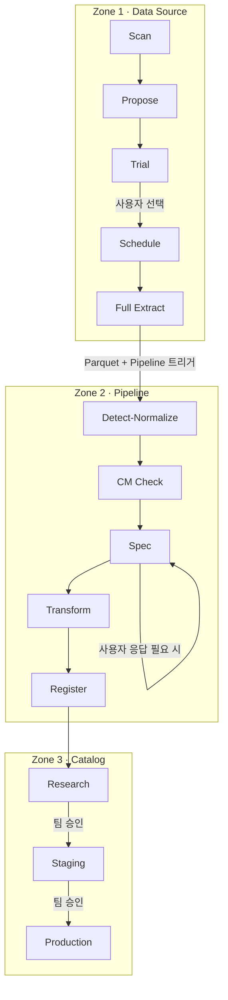
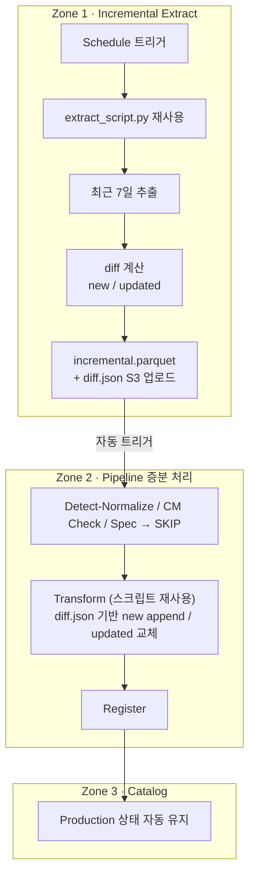
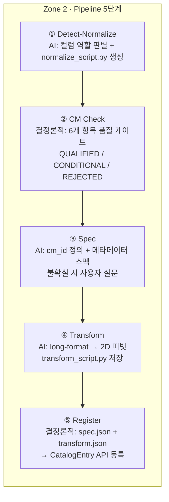

# Arkraft 데이터 파이프라인 개요

외부 데이터베이스를 연결해서 분석에 바로 쓸 수 있는 카탈로그 자산으로 만드는 전 과정을 자동화한다.

---

## 전체 흐름

### ① 최초 온보딩

### ② 운영 중 반복 (스케줄마다 자동)

---

## Zone 1 · Data Source

| 단계 | 실행 주체 | 설계 의도 |
|------|----------|----------|
| **Scan** | Python (AI 없음) | information_schema 쿼리로 전체 테이블·컬럼·인덱스·행 수 추정. Full scan 없이 메타데이터만 수집해 Propose의 판단 근거로 넘긴다 |
| **Propose** | Claude | Scan 결과 전체를 AI에 넘겨 연구용 테이블만 선별. 운영용(감사 로그, 세션 등)은 걸러내고 가격 시계열·팩터·참조 데이터 중심으로 제안을 생성한다 |
| **Trial** | Claude | 테이블별 3행 샘플 조회 후 extract_script.py 작성. PostToolUse 훅이 즉시 자동 실행하고 실패 시 stdout/stderr 피드백으로 수정을 반복한다. 결과(null 비율·날짜 공백·값 분포)를 미리보기로 제공하면 사용자가 Selected / Rejected를 결정한다 |
| **Schedule** | 사용자 | 동기화 주기 설정 (일별·주별·월별 등). 이후 Incremental Extract가 해당 주기에 맞춰 자동으로 실행된다 |
| **Full Extract** | Claude | 날짜 단위 순차 추출. 공휴일·공백일 skip. per-day Parquet → DuckDB 병합 → extract_data.parquet → Pipeline 자동 트리거 |
| **Incremental Extract** | Python + Claude | extract_script.py 재사용, 최근 7일 추출, S3 기존 데이터와 diff 계산(new/updated), incremental.parquet + diff.json 업로드, Pipeline 자동 트리거 |

---

## Zone 2 · Pipeline

| 단계 | AI 여부 | 설계 의도 |
|------|---------|----------|
| **Detect-Normalize** | AI | 컬럼 역할(시간축·엔티티키·값) 판별, 컬럼명 정규화, normalize_script.py 생성. 벤더 스펙 문서 업로드 시 코드 매핑까지 반영 |
| **CM Check** | 없음 | DuckDB 3쿼리로 6개 항목 체크: 파싱 가능·시간축 존재·엔티티축 존재·값 컬럼 존재·null 비율·행 수 |
| **Spec** | AI | `Universe.Name` 형식 cm_id 정의, 시간축·엔티티축·값 컬럼 메타데이터 스펙 작성. 확신이 없는 필드·카탈로그 충돌·ID 매칭 미완 시에만 사용자에게 질문 |
| **Transform** | AI | Spec 기준으로 long-format → 2D 피벗. 값 컬럼별 Parquet 생성. transform_script.py 저장 |
| **Register** | 없음 | spec.json + transform.json 읽어서 CatalogEntry API 등록, 카탈로그 인덱스 재빌드 |

---

## Zone 3 · Catalog

등록된 데이터셋은 세 단계의 품질 등급으로 관리된다.

| 등급 | 의미 |
|------|------|
| **Research** | 처음 등록된 상태. 탐색은 가능하지만 미검증 |
| **Staging** | 팀 리뷰를 거쳐 올라온 단계. 테스트 전략에 사용 가능 |
| **Production** | 라이브 전략에 써도 될 만큼 신뢰도가 검증된 상태 |

각 카탈로그 항목에는 유니버스, 주기, 시간축·엔티티축 정의, 출처(Lineage), 전체 텍스트 검색용 컬럼 인덱스가 포함된다.

---

## 사람이 개입하는 순간

| 시점 | 내용 |
|------|------|
| Trial 결과 검토 | Selected / Rejected 결정 |
| Spec 생성 중 | 불확실한 필드 질문 응답 (해당 없으면 자동 완료) |
| Zone 3 품질 승격 | Research → Staging → Production 직접 승인 |

운영 중 반복 흐름(Incremental Extract → Pipeline → Catalog 갱신)은 사람 개입 없이 완전 자동으로 실행된다.
